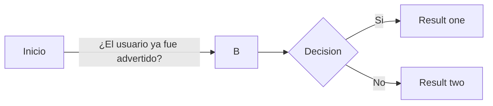

---


---


```
                 [Inicio]
                     ↓
       [1. ¿El usuario ya fue advertido?]
       ↙                            ↘
    [ No ]                          [ Sí ]
      ↓                               ↓
[Advierte al usuario]        [Implementa un "Warn"]
       ↓                                ↓
   [¿Persiste?]            [¿El usuario se calmo?]
      ↓                        ↙                ↘
   [ Sí ]                   [ No ]             [ Sí ]
      ↓                       ↓                   ↓          
      ↓                 [Dale un "Mute"]         [Fin]                         
      ↓                                                         
      ↓
[Implemeta su "Warn" correspondiente] 


```


---





Bienvenido al apartado de reglas. Aquí podrás ver a detalle las normas y directrices que rigen nuestra comunidad. Es fundamental que todos los miembros las conozcan y respeten para asegurar un ambiente agradable y seguro para todos.

- El propósito de esto es mejorar la calidad y abarcar la mayor parte de los problemas que puedan surgir en la comunidad. En este proyecto me basaré en las reglas ya impuestas en la **"ToS de Discord"** y en las normas internas de **Reino Estelar**.

Así que siéntete libre de explorar más a fondo la **Intranet Estelar**. En las siguientes páginas te daré explicaciones más detalladas sobre cada regla y su aplicación.

---


¡Bienvenido a la **Guía de Moderación**!  
Aquí encontrarás información clave para comenzar tu camino como <span style="color:pink;">**aprendiz**</span> dentro del equipo de moderación.

Esta guía está diseñada para brindarte una base sólida, ayudarte a entender cómo funcionan las herramientas del servidor y qué se espera de ti como nuevo miembro del staff.

---

## 🛠️ Herramientas básicas del staff

- Utilizamos el bot <span style="color:red;">**UnbelievaBoat**</span> para aplicar sanciones mediante comandos. Si quieres conocer todos sus comandos, visita su [página oficial](https://unbelievaboat.com/commands).
- En caso de que UnbelievaBoat esté fuera de servicio, puedes usar <span style="color:green;">**Carl-Bot**</span> como respaldo.
- También empleamos <span style="color:orange;">**YAGPDB**</span> para registrar palabras eliminadas en el servidor.

---

## ❌ Comandos no disponibles para aprendices

⚠️ Como <span style="color:pink;">**aprendiz**</span>, no tienes acceso a los siguientes comandos de moderación:

- `u!ban`
- `u!temp-ban`
- `u!edit-case`
- `u!delete-case`
- `u!soft-ban`
- `u!un-mute`

En situaciones que requieran el uso de estos comandos, debes **consultar con un miembro superior**:  
<span style="color:Violet;">**Helper**</span>, **Moderador**, o **Administrador**.

> ⚡ **Usa tu criterio**:  
> En casos urgentes, resuelve con las herramientas que tienes. Tu juicio responsable es parte de tu entrenamiento.

---

## 📎 Adjuntar pruebas: tu responsabilidad

Como aprendiz, tú eres quien debe recopilar y **adjuntar las pruebas** relacionadas con sanciones, reportes o intervenciones.  
Este registro será **clave** para evaluar tu desempeño y evolución en el equipo.

---

!!!warning "Recomendaciones"
- No dudes en pedir ayuda a los Helpers, Mods o Admins.
- Preguntar **nunca está mal**. Lo realmente malo es quedarse con la duda.
!!!

---

## 📝 Nota final

Ten presente que esta guía **no cubre todas las situaciones posibles**.  
Cada caso que enfrentas como moderador es único, y tu criterio personal marcará la diferencia.

Esta guía es una herramienta de apoyo, un punto de partida para tu formación como moderador responsable, justo y comprometido.

---


------------

## 🌟 ***Evidencia y testigos***

Es altamente recomendable contar con un testigo al momento de intervenir en una situación, idealmente otro miembro del equipo de moderación. En caso de que esto no sea posible, se sugiere registrar lo ocurrido mediante una grabación. Las evidencias en formato de video resultan ser las más claras y efectivas al momento de evaluar o gestionar un caso.

---

## 🎙️ ***Solo dos***

Para mantener el orden y evitar saturaciones en los canales de voz, se establece que un máximo de **dos** moderadores deben estar presentes simultáneamente al resolver un caso.

---

## 🎧 ***Disponibilidad***

La moderación de los canales de voz requiere contar con un **micrófono decente** y la capacidad de hablar con claridad. Si no te es posible comunicarte de forma verbal, solicita a un compañero que asuma la responsabilidad de llevar la voz del caso.

---

## 🔍 ***Discreción***

Está permitido realizar revisiones periódicas en los canales de voz para asegurar el cumplimiento de las normas. Sin embargo, se debe evitar permanecer en dichos canales sin una razón justificada, así como grabar conversaciones de forma continua, ya que esto podría generar incomodidad entre los usuarios.

---

!!!Danger **🔒 Confidencialidad**
Queda terminantemente prohibido divulgar cualquier tipo de información relacionada con las actividades internas del equipo de moderación, incluyendo sus sistemas o procesos. La revelación de este tipo de datos puede conllevar a la **expulsión inmediata** del equipo.
Asimismo, no está permitido compartir detalles de reportes o casos que estés gestionando o hayas gestionado, ya que **toda consulta o denuncia presentada debe tratarse con anonimato y estricta confidencialidad**.
!!!

---
